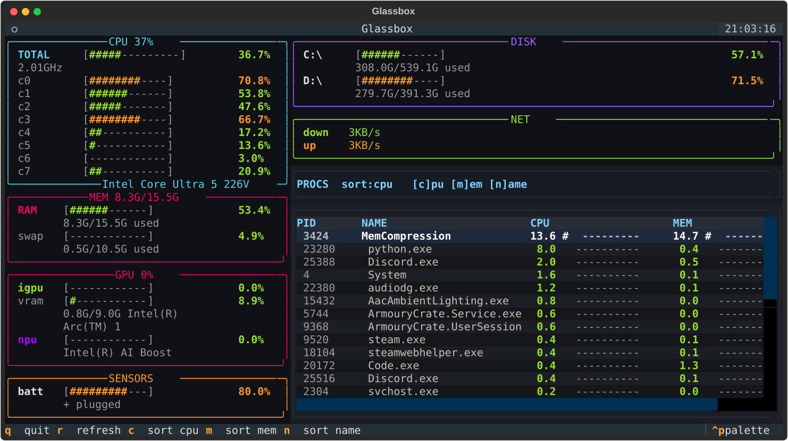

# ◈ glassbox

A live system monitor for your terminal. CPU, memory, disks, network, GPU, NPU, sensors, and top processes — refreshing every second, styled like `btop`.



## Features

- **CPU** — total + per-core `#` bars, clock speed, chip name in the panel corner
- **MEM / DISK** — btop-style bars with used/total on their own dim line
- **NET** — live down/up rates
- **GPU** — NVIDIA via NVML, any-vendor (Intel Arc, AMD, …) via Windows counters, one row per adapter tagged `igpu` / `gpu` (library-first, automatic DXGI/WMI fallback)
- **NPU** — separate box with neural-engine load (e.g. Intel AI Boost) from `engtype_Neural` counters; hidden entirely when no NPU hardware is found
- **SENSORS** — battery, temps, fans, uptime fallback on Windows
- **PROCS** — sortable top-30 table with mini bars (`c` / `m` / `n`)
- **Smooth** — all stat gathering runs on a background thread, the UI never freezes

## Stack

| Piece | Role |
|---|---|
| `psutil` | CPU, RAM, disks, net, temps, processes |
| `pywin32` (PDH + WMI) | iGPU/NPU load, VRAM, device names on Windows |
| `ctypes` + DXGI | per-adapter luids, exact names, igpu/dgpu split (stdlib, no dep) |
| `nvidia-ml-py` | NVIDIA load, VRAM, temp |
| `textual` | app shell, layout, keys, 1s poll loop |
| `rich` | panels, tables, colored `#` bars |
| `threading` | collector thread + `call_from_thread` paints |

## Quickstart

```powershell
# local dev, venv already in the repo — use it, not global python
.\venv\Scripts\python.exe -m pip install -r requirements.txt
.\venv\Scripts\python.exe app.py
```

## Download

No Python, no install — grab a standalone binary from GitHub Releases:

### Windows

1. Download `glassbox-win-x64.exe`
2. Double-click it — that's it.

```powershell
.\glassbox-win-x64.exe
```

### Linux

1. Download `glassbox-linux-x64.tar.gz`
2. Extract it, make it executable, run it:

```bash
tar -xzf glassbox-linux-x64.tar.gz
chmod +x glassbox-linux-x64
./glassbox-linux-x64
```

## Keys

| Key | Action |
|---|---|
| `q` | quit |
| `r` | refresh now |
| `c` / `m` / `n` | sort processes by CPU / MEM / name |

## Layout

```
app.py            the app shell (UI, layout, keys, 1s poll loop)
stats.py          all stat collectors (cpu, mem, gpu, npu, procs)
shot.py           re-captures screenshot.svg (venv python shot.py)
requirements.txt  pinned dev deps for the local venv
screenshot.svg    real capture of the app
```

## Notes

- First tick shows zeros — `psutil` and PDH need one warmup sample by design.
- Process CPU is normalized to 0–100% across all cores (no 600% ghosts).
- No NVIDIA card? That path quietly returns `[]`. No NPU? Same deal.
- Windows-only bits (`win_gpu`, `npu`, `cpu_name`) degrade to empty lists / `"CPU"` anywhere else.
- `igpu` vs `gpu`: matched per-adapter via DXGI luids; ≥1GB dedicated VRAM counts as discrete (`gpu`). Software adapters (Basic Render Driver) are skipped. Full adapter names are shown, never clipped to a prefix.
